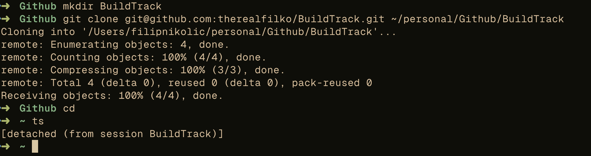
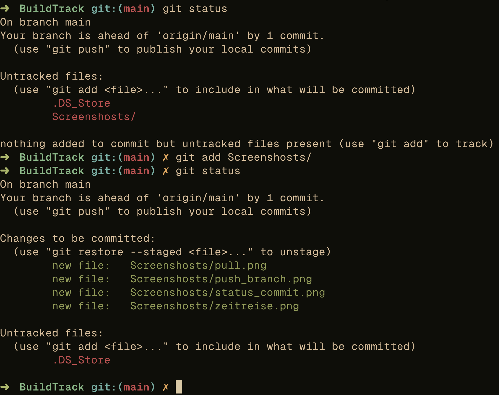
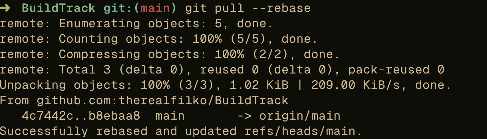
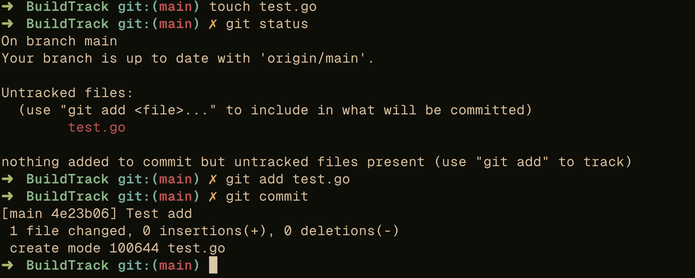
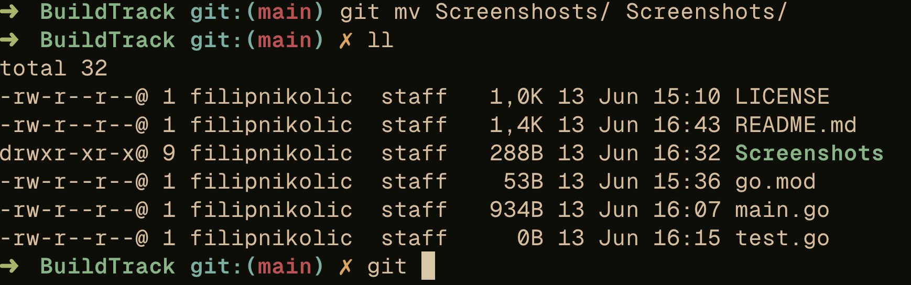
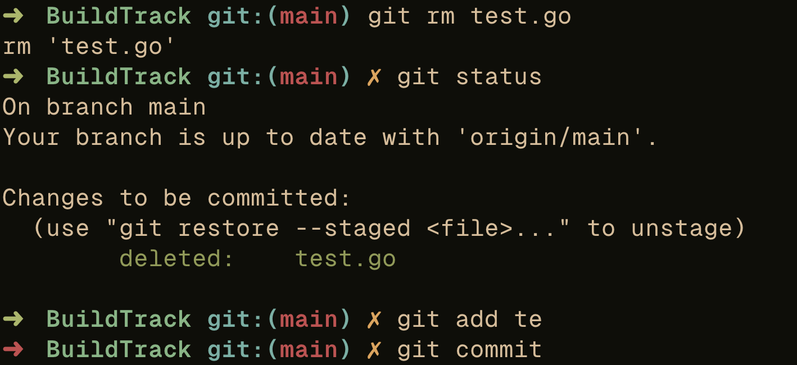
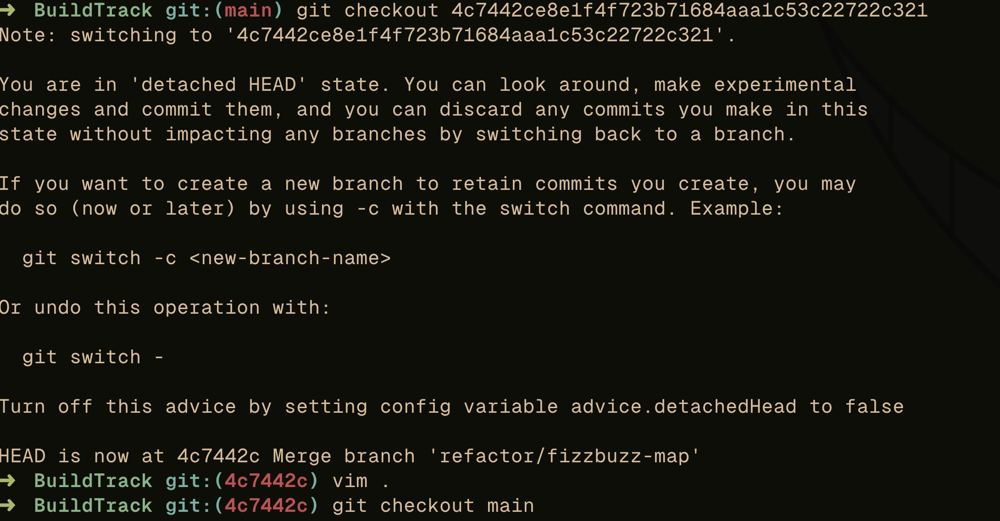
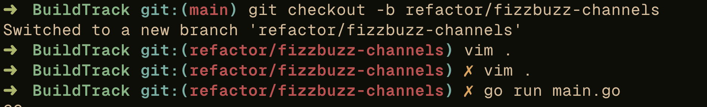
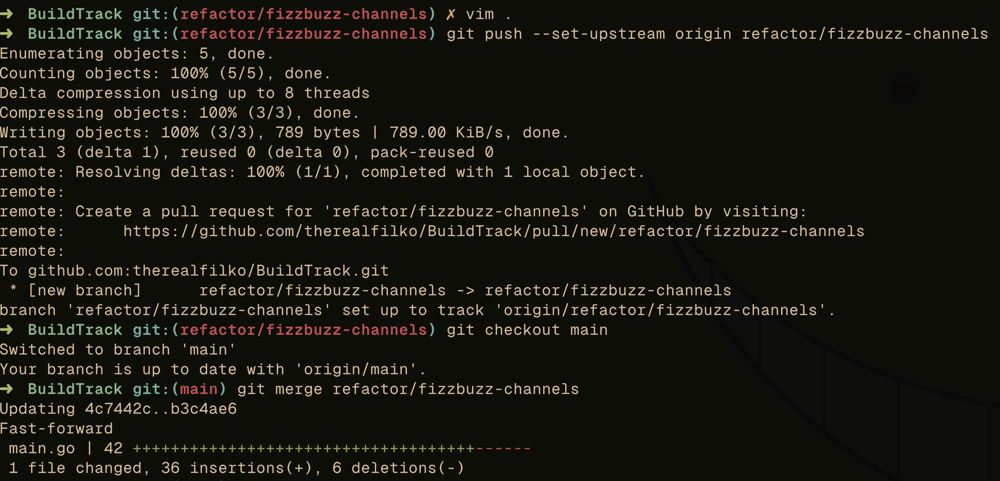

## 1. Erstellen Sie sich ein Repository in Github oder GitLab.
Um die Versionskontrolle für dieses Projekt zu demonstrieren, habe ich ein öffentliches Repository 
auf GitHub erstellt. Dieses Repository enthält die Implementierung von FizzBuzz in Go sowie die 
zugehörigen Dokumentationen und Screenshots, die die Verwendung verschiedener Git-Methoden zeigen.

### Schritte zur Erstellung des Repositories:
1. Anmeldung bei GitHub.
2. Erstellung eines neuen Repositories mit den folgenden Details:
    - **Repository Name**: BuildTrack
    - **Description**: Implementierung von FizzBuzz mit Maps und Channels in Go
    - **Public**: Ausgewählt, um das Repository öffentlich zugänglich zu machen.
3. Klonen des leeren Repositories in einen lokalen Ordner:
    ```sh
    git clone git@github.com:therealfilko/BuildTrack.git
    ```

### Git Clone


## 2. Pushen Sie ein eigenes Projekt von Ihnen hoch (z.B. das CCD-Projekt) oder erstellen Sie ein neues Projekt!
Hier habe ich zum Spaß verschiedene Versionen von FizzBuzz erstellt und sie in eigene Branches gepackt.

## 3. Wenden Sie alle in den Unterlagen genannten relevanten Methoden beweisbar an: (das Github Repo ist Beweis) push, pull, add, commit, diff, status, rm/mv, etc.
### Git Status und Git Add


### Git Pull


### Git Status und Commit


### Git mv


### Git rm


## 4. Experimentieren Sie mit Zeitreisen!


## 5. Erstellen sie zwei unterschiedliche aber ähnliche Branches, wechseln sie hin und her und mergen sie diese Branches dann wieder!
Ich habe zwei unterschiedliche Branches erstellt: `refactor/fizzbuzz-map` und `refactor/fizzbuzz-channels`. 
Diese Branches enthalten ähnliche, aber unterschiedliche Implementierungen von FizzBuzz.

### Git Branch


### Git Merge


## 6. Erstellen Sie in GitHub einen Pull-Request bezugnehmend auf https://github.com/edlich/education! Bitte referenzieren Sie auf den Pull-Request mit Link oder der Pull-Request Nummer! Kryptische GitHub Namen kann ich kaum zuordnen. Die Aufgabenteile vor dem Pull-Request bitte nicht in den Pull-Request einbauen, sondern extra abgeben!
Der Pull-Request wurde erstellt und kann [hier](https://github.com/edlich/education/pull/503) eingesehen werden.
PR Nummer: #503

